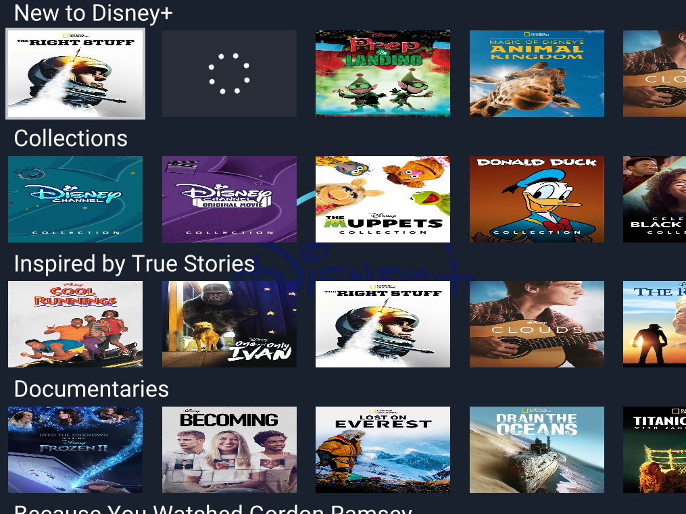

# Portcullis

> Imagined as a sort of "front gate" to the Disney castle.



## Building & Running

```bash
$ git clone https://github.com/Pebaz/portcullis
$ cd portcullis
$ cargo run --release
```

## Instructions

1. Use arrow keys ⬅️⬆️⬇️➡️ to navigate through the collections
2. Use enter ⌨️ to watch the selected content
3. Use escape 🏃‍♂️ to stop the selected content
4. Use escape 🏃‍♂️ on the main screen to exit the application